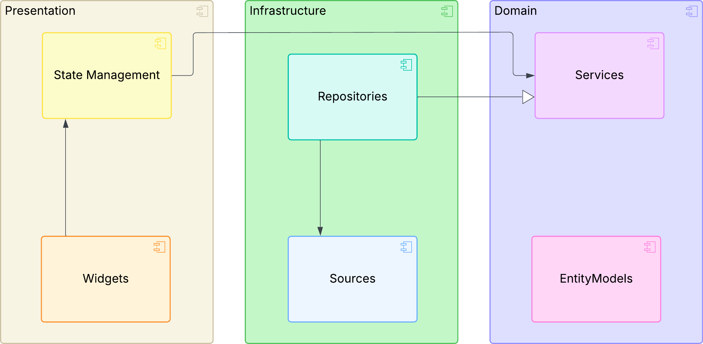
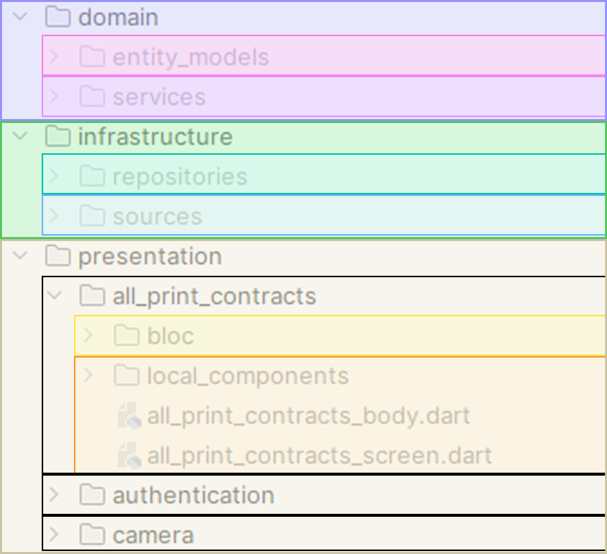
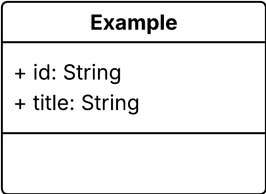

# reconstructitapp

This frontend was developed as part of a bachelor’s project to demonstrate the concept of
Reconstructit. The app aims to make repairing everyday objects more accessible and sustainable by
enabling users to generate 3D models of missing or broken parts from photos. These models can either
be 3D-printed directly or requested from the community.

This app is only a pre alpha version to demonstrate some use-cases of the platform.

## Run the App

To execute the application, ensure that both Flutter and Dart are installed on your system.

Follow the official [Flutter installation guide](https://docs.flutter.dev/get-started/install) to
set up your development environment.

Once the environment is ready, run the following commands in the project root directory:

``` bash
dart pub get
```

Download and installs the required dependencies.

``` bash
dart run build_runner build
```

Generate important files.

## Dependencies

In Flutter we differ between dev dependencies and dependencies. Both are managed in the ``
pubspec.yaml`` in the project root. 

While it is possible to create custom plugins, most integrations are handled through publicly
available packages.
Those public plugins can be found on https://pub.dev/packages.

Every plugin at this page has a installing chapter and a readme to show how this gets integrated.

Each package includes installation instructions and integration details. These instructions specify
whether the dependency should be added as a runtime dependency or as a dev-dependency.

Dependencies are typically installed using the following command:

``` bash
flutter pub add package_name
```

### Dependencies used in this Project

In this subchapter the dependencies used in this project, including their purpose, are listed:

**Dependencies**

flutter_bloc:
=> used for state Management

get_it:
=> used for dependency injection

google_fonts:
=> used for externally imported fonts

json_annotation:
=> used to automatically generate to and from JSON methods to models

intl:
=> Internationalization and localization

dio:
=> used as http client

retrofit:
=> used to generate boilerplate api request implementations

jwt_decode:
=> used to decode a JSON Web Token an get specific attributes

oauth2:
=> authentication plugin

path_provider:
=> to get the application Documents Directory and safe local files

camera:
=> take images

image_picker:
=> to pick an image from gallery

shared_preferences:
=> to locally store a single a primitive attribute

webview_flutter:
=> to boot the identity server

shimmer:
=> to show loading shimmer

file_picker:
=> to upload a local file, in this case the stl file

url_launcher:
=> to download a file, in this case the stl file

**Dev-Dependencies**

build_runner:
=> to generate files, used for the JSON and retrofit generations

json_serializable:
=> used to automatically generate to and from JSON methods to models

retrofit_generator:
=> used to generate complete datasources

## App Architecture

This project follows the principles of Clean Architecture



The Architectual Overview shows that there are three primary layers:

1. Presentation
2. Infrastructure
3. Domain

Those layers and its components are explained in the following sections.



The layer - folder assignment is described with colors here.
While the Domain and Infrastructure layers follow a straightforward mapping, the Presentation layer
uses a feature-based structure. Each feature folder contains its related screens, widgets, and state
management logic.

### Domain Layer

The Domain layer contains the entity models and services.

**Entity Models**

In this project, the entity models are derived from the domain model. As an example, we use the
Example Entity.



Now, we create an Example Entity-Model in the entity_models folder.

To do this, we define a class and add the required attributes. The Example entity model will look as
follows:

``` dart
class Example {
  final String id;
  final String title;
  Example(this.id, this.title);
}
```

Since this model is used across all layers of the application, it also requires fromJson and toJson
methods for interaction with the REST API.
The json_annotation plugin facilitates this process. At the top of the file,
add ``part 'example.g.dart';``. The generated code will be placed in this file, which does not need
to be created manually.

Additionally, annotate the Example class with @JsonSerializable() and define the fromJson and toJson
methods that delegate to the generated code. The resulting file should look as follows:

``` dart
import 'package:json_annotation/json_annotation.dart';

part 'example.g.dart';

@JsonSerializable()
class Example {
  final String id;
  final String title;

  Example(this.id, this.title);

  factory Example.fromJson(Map<String, dynamic> json) =>
      _$ExampleFromJson(json);


  Map<String, dynamic> toJson() => _$ExampleToJson(this);

}

```

Finally, run the following command in the project root to generate the example.g.dart file:

``` bash
dart run build_runner build
```

**Services**

Services define the abstract operations available for each entity. They are consumed by the
Presentation layer (via state management) and implemented in the Infrastructure layer through
repositories.

Each entity should be associated with a dedicated service. For the Example entity, this is the
ExampleService. A service is defined as an abstract class, and all operations related to the entity
are declared here. Typical operations include API calls and local storage access. In most cases,
these methods are asynchronous.

The ``ExampleService`` could be defined as follows:

``` dart
abstract class ExampleService {
   Future<Result<Example>> getLocallySelectedExample();

  Future<Result<Example>> getExample(String id);

  Future<Result<Example>> createExample(Example example);

  Future<Result<void>> editExample(Address address);

  Future<Result<void>> deleteExample(String id);
}
```

### Infrastructure Layer

The Infrastucture layer contains the datasources and repositories. A repository implements a service
and delegates its operations to one or more data sources.

**Datasources**

Data sources are responsible for either accessing remote APIs or interacting with the local storage
of the application. Accordingly, we distinguish between remote data sources and local data sources.

Since local data sources are straightforward, the following section focuses on the remote data
source.

For the entire application, there is a single IRemoteDatasource. To reduce boilerplate code,
the [Retrofit package](https://pub.dev/packages/retrofit) is used. Its structure is defined as
follows:

``` dart

part 'remote_datasource.g.dart';

@RestApi(
  baseUrl:
      'https://reconstructitbackend-b8dcdscua2bcfxdf.northeurope-01.azurewebsites.net/',
)
abstract class IRemoteDatasource {
  factory IRemoteDatasource(Dio dio, {String baseUrl}) = _IRemoteDatasource;
}
```

The ``build_runner`` tool is again required here to generate the ``.g.dart`` file.

Within this class, the endpoints of the API are declared. For example, retrieving an Example entity
by its ID is implemented as:

``` dart
@GET('/api/Examples/{id}')
Future<Example> getExample(@Path() String id);
```

Here, the REST method and relative path are specified in the annotation above the method. Path
parameters are wrapped in curly brackets in the URL and must be annotated with ``@Path()`` in the
method signature.

An update endpoint, which requires a request body, can be defined as follows:

``` dart
@PUT('/api/Examples/{id}')
Future<void> updateExample(@Path() String id, @Body() Example example);
```

A Body can just be parsed as an attribute with the Annotation ``@Body()``.

Now, you can run ``dart run build_runner build`` again, to create the remote_datasource.g.dart.

**Repositories**

As already mentioned, Repositories implement the services defined in the Domain layer and use the
data sources to perform the actual operations.
A minimal implementation of the ``ExampleRepository``, which implements the ``ExampleService``, is
shown below:

```dart
class ExampleRepository implements ExampleService {
  final IRemoteDatasource remoteDatasource;

  ExampleRepository(this.remoteDatasource);
}
```

In addition to the ``IRemoteDatasource``, a repository may also integrate a local data source e.g. to integrate caching. After
importing the ``ExampleService``, most IDEs will suggest implementing its abstract methods.

For example, the getExample method can be implemented as follows:

```dart
@override
Future<Result<Example>> getExample(String id) async {
  try {
    return Result.success(await remoteDatasource.getExample(id));
  } catch (e) {
    return Result.fail(e as Exception);
  }
}
```

In essence, the repository translates the data source result into a Result object. However, it can
also be extended with additional logic, such as security checks or specialized error handling.

### Presentation Layer

The Presentation Layer differs from the other two layers in its structure. Instead of being
organized by entities, it is organized by feature folders, each representing a screen or a major
widget.

Each feature folder typically contains:

- a bloc folder for state management
- one or two top-level widget files
- optionally a local_components folder with smaller widgets used by the top-level files

As already mentioned the chosen state management framework is Bloc. You can find the documentation at
the [pub.dev link](https://pub.dev/packages/flutter_bloc).
Below is a summary of how Bloc is structured and used in this application.

In the bloc folder, there are three files,
named ``feature_folder_name_bloc``, ``feature_folder_name_state`` and ``feature_folder_name_event``.

Events define what can happen in the feature:

``` dart

class FeatureFolderNameEvent {}

class FeatureFolderNameRefresh extends FeatureFolderNameEvent {}

```

Events can also carry attributes, depending on the use case.

States represent the possible conditions of the UI:

``` dart

abstract class FeatureFolderNameState {}

class FeatureFolderNameInitial extends FeatureFolderNameState {}

class FeatureFolderNameLoading extends FeatureFolderNameState {}

class FeatureFolderNameLoaded extends FeatureFolderNameState {
  final List<Example> examples;

  FeatureFolderNameLoaded(this.examples);
}

class FeatureFolderNameFailed extends AllPrintContractsState {
  final Exception exception;

  FeatureFolderNameFailed(this.exception);
}

```

In this example, the state holds a list of Example entities. For operations without data (e.g.,
create/delete/update), you can use a Succeeded state instead of Loaded.

Bloc Implementation combines events and states:

``` dart
class FeatureFolderNameBloc
    extends Bloc<FeatureFolderNameEvent, FeatureFolderNameState> {
  final ExampleService exampleService;

  FeatureFolderNameBloc(
    this.exampleService,
  ) : super(FeatureFolderNameInitial()) {
    on<FeatureFolderNameRefresh>(_onRefresh);
  }

  void _onRefresh(FeatureFolderNameRefresh event, emit) async {
    emit(FeatureFolderNameLoading());
    var exampleResult = await exampleService.getExamples();
    if (!exampleResult.isSuccessful) {
      emit(FeatureFolderNameFailed(exampleResult.failure!));
      return;
    }

    emit(FeatureFolderNameLoaded(exampleResult.value!));
  }
}
```

A Bloc file has services (from the domain folder) as dependencies and uses them exclusively to
perform interactions.
In the constructor, it calls the super constructor of the Bloc and passes the initial state. This
state is always emitted as long as no event has been triggered.
Events are also registered here; we call these event handlers. In this case, the _onRefresh method
is executed when the FeatureFolderNameRefresh event is dispatched.

Now let’s take a closer look at the _onRefresh method. The event and a function to emit a state are
provided in the method signature. If the event had attributes, they could be accessed via
event.attributeName.
Inside the method, the Loading state is emitted first.
Next, the service method is called. The response is a Result object, which exposes an isSuccessful
flag. We can check whether the transaction was successful. If not, the Failed state is emitted and
the method ends.
If the transaction succeeds, the Loaded state is emitted with the value from the result (in this
case a list of examples).

To use the Bloc, it must be registered in ``dependecies.dart``:

```dart
ic.registerFactory<FeatureFolderNameBloc>
(() => FeatureFolderNameBloc(ic()));
```

Make sure the corresponding service is also registered.

Now let’s look at how the Bloc is used inside widgets.
Imagine we want to build a screen that displays a list of examples along with a button to refresh
the list.

To achieve this, we first create a stateful
widget ([read about stateful and stateless widgets here](https://docs.flutter.dev/ui/interactivity))
in ``examples_screen.dart``:

 ```dart
class ExamplesScreen extends StatefulWidget {
  const ExamplesScreen({super.key});

  @override
  State<ExamplesScreen> createState() => _ExamplesScreenState();
}

class _ExamplesScreenState extends State<ExamplesScreen> {
  @override
  Widget build(BuildContext context) {
    return BlocProvider(
      create: (_) =>
      ic<FeatureFolderNameBloc>()
        ..add(FeatureFolderNameRefresh()),
      child: Scaffold(body: ExamplesBody()),
    );
  }
}
 ```

The BlocProvider initializes the Bloc and immediately triggers the ``FeatureFolderNameRefresh``
event.

Next, we create the ``ExamplesBody`` widget in ``examples_body.dart``:

```dart
class ExampleBody extends StatelessWidget {
  const ExampleBody({super.key});

  @override
  Widget build(BuildContext context) {
    return BlocBuilder<FeatureFolderNameBloc, FeatureFolderNameState>(
      builder: (context, state) {
        if (state is FeatureFolderNameLoading) {
          return Center(child: CircularProgressIndicator());
        } else if (state is FeatureFolderNameLoaded) {
          return Scaffold(
            body: Column(
              mainAxisSize: MainAxisSize.min,
              children: [
                Column(
                  children: List.generate(
                    state.examples.length,
                        (int index) => Text(state.examples[index].title),
                  ),
                ),
                FilledButton(
                  onPressed: () {
                    context.read<FeatureFolderNameBloc>().add(
                      FeatureFolderNameRefresh(),
                    );
                  },
                  child: Text("Refresh"),
                ),
              ],
            ),
          );
        } else if (state is FeatureFolderNameFailed) {
          return Container();
        }
        return Container();
      },
    );
  }
}

```

Here, the BlocBuilder reacts to state changes and builds the UI accordingly:

In the Loading state, a loading indicator is displayed.
In the Loaded state, the list of examples is shown. With state.examples, we can access the loaded
data directly.
In the Failed state, a fallback widget can be returned.

To trigger the refresh, the button calls:

```dart
context.read<FeatureFolderNameBloc>
().add(FeatureFolderNameRefresh());
```

This line requires that the BlocProvider is already available in the widget tree, which is why we
use two files (``ExamplesScreen`` and ``ExamplesBody``).
If no events (apart from the initial one) are triggered inside the widget, a single top-level file
is often sufficient.

``` dart

class ExampleBody extends StatelessWidget {
  const ExampleBody({super.key});

  @override
  Widget build(BuildContext context) {
    return BlocBuilder<FeatureFolderNameBloc, FeatureFolderNameState>(
      builder: (context, state) {
        if (state is FeatureFolderNameLoading) {
          return Center(child: CircularProgressIndicator());
        } else if (state is FeatureFolderNameLoaded) {
          return Scaffold(
            body: Column(
              mainAxisSize: MainAxisSize.min,
              children: [
                Column(
                  children: List.generate(
                    state.examples.length,
                    (int index) => Text(
                      state.examples[index].title
                    ),
                  ),
                ),
                FilledButton(
                  onPressed: () {
                    context.read<FeatureFolderNameBloc>().add(
                      FeatureFolderNameRefresh(),
                    );
                  },
                  child: Text("Refresh"),
                ),
              ],
            ),
          );
        } else if (state is FeatureFolderNameFailed) {
          return Container();
        }
        return Container();
      },
    );
  }
}

```

If code snippets like the refresh button are used multiple times in one file, they can be extracted
into a new widget (e.g. RefreshButton) and placed in the local_components folder.